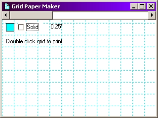



## Graph Paper Maker

### Description

This is very beginner stuff. Today I needed some graph paper but could not find any in the office so I very quickly just slapped this together to make some. There really is nothing fancy in here other than some sample code of how to use the Line method which is very VERY basic. Not really expecting any votes but just thought I would share it in case anybody else out there needs some graph paper or wants to use this for something more advanced. KEYWORDS: LINE METHOD, GRAPH PAPER. ADDED NOTES: Since I have had a comment about it, this code also does include a class module that can be reused as is in any other application that will allow the developer to call the common dialog control WITHOUT having to have a reference to the control or have to have a form for it. The class module will just use what ever version is available on the system thus you do not have to include the common dialog in an install. Just thought I would add that since some may not download this because they do not care about graph paper.
 
### More Info
 

             |
---                |---
**Submitted On**   |2002-09-30 18:33:08
**By**             |[Clint LaFever](https://github.com/Planet-Source-Code/PSCIndex/blob/master/ByAuthor/clint-lafever.md)
**Level**          |Beginner
**User Rating**    |4.6 (23 globes from 5 users)
**Compatibility**  |VB 6\.0
**Category**       |[Complete Applications](https://github.com/Planet-Source-Code/PSCIndex/blob/master/ByCategory/complete-applications__1-27.md)
**World**          |[Visual Basic](https://github.com/Planet-Source-Code/PSCIndex/blob/master/ByWorld/visual-basic.md)
**Archive File**   |[Graph\_Pape1387669302002\.zip](https://github.com/Planet-Source-Code/clint-lafever-graph-paper-maker__1-39402/archive/master.zip)

